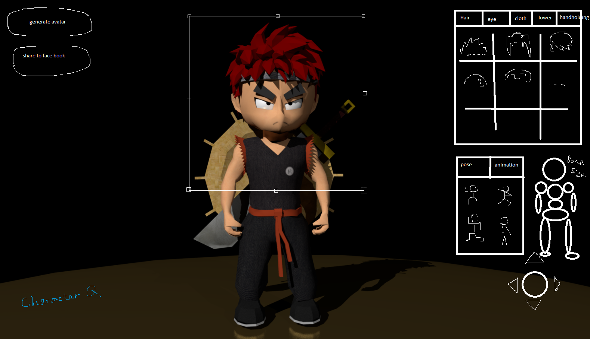

# CharacterQ

A hole to fill in this summer: 

An Three.js app for generating character with components of models

~~Might use glTF format to take advantage of the node hierachy => proxy (weapon, glasses), animation/skeleton~~
(fbx => glTF converter still seems to be not very mature) 

## A very sketchy design:

